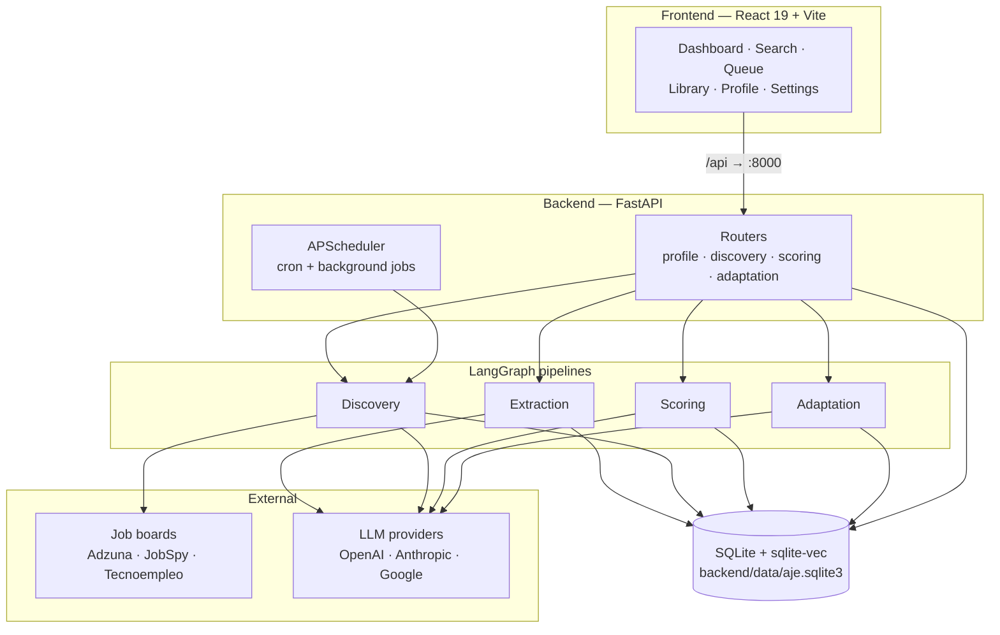
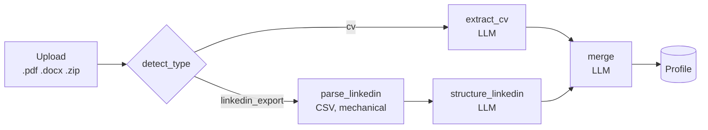
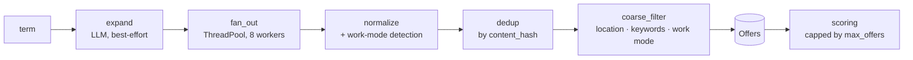
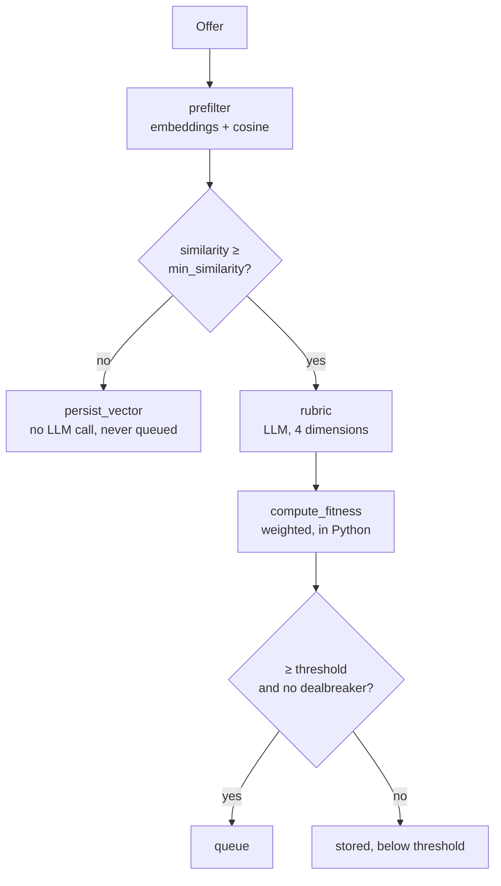
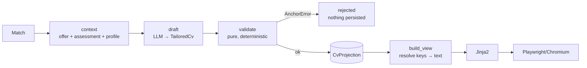
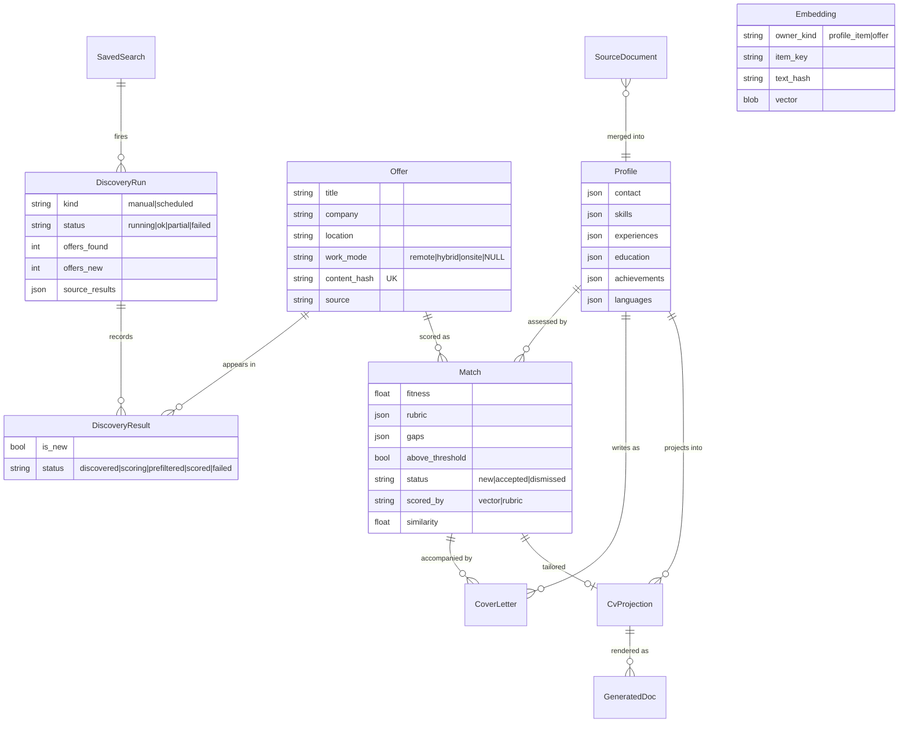
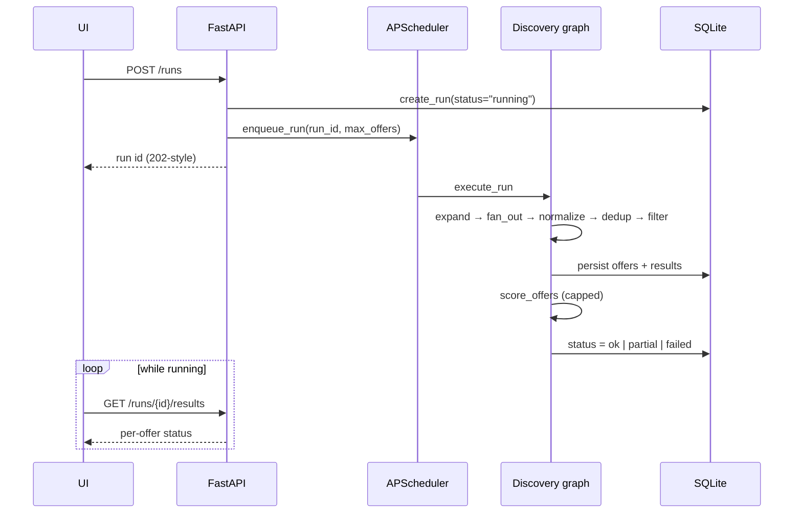

# Agentic Job Engine

A local-first job search engine. It ingests your CV and LinkedIn export into a single
structured **Profile**, discovers offers across several job boards, scores each one
against you with an LLM rubric, and drafts a tailored CV and cover letter for the ones
worth applying to.

It runs entirely on your machine against a SQLite database. Nothing is uploaded
anywhere except the LLM calls it makes on your behalf.

---

## Table of contents

- [The idea](#the-idea)
- [Architecture](#architecture)
- [The four pipelines](#the-four-pipelines)
  - [1. Extraction](#1-extraction--documents--profile)
  - [2. Discovery](#2-discovery--search-terms--offers)
  - [3. Scoring](#3-scoring--offers--matches)
  - [4. Adaptation](#4-adaptation--match--cv--cover-letter)
- [Data model](#data-model)
- [Run lifecycle](#run-lifecycle-async-jobs-and-the-scheduler)
- [Module reference](#module-reference)
- [HTTP API](#http-api)
- [Frontend](#frontend)
- [Configuration](#configuration)
- [Cost model](#cost-model)
- [Running it](#running-it)
- [Testing](#testing)
- [Conventions and gotchas](#conventions-and-gotchas)

---

## The idea

Three ideas carry the whole design.

**One Profile is the source of truth.** Every CV or LinkedIn export you upload is
merged into a single structured Profile. Nothing downstream reads your documents — they
read the Profile. That means a tailored CV can be checked against it mechanically.

**Anchoring instead of trust.** When the model drafts a tailored CV, it does not write
prose freely. It emits `source_key` references — `experience:acme|backend engineer`,
`skill:python` — pointing at Profile items. A pure, deterministic validator rejects any
draft referencing a key the Profile does not contain. A model cannot invent a job you
never had, because it has no key to cite for it.

**Spend is a first-class constraint.** LLM scoring is the product's core claim and also
its main cost. A cheap embedding prefilter gates the expensive rubric call, runs carry
an explicit cap, and the arithmetic that turns model scores into a fitness number lives
in Python so weights can be retuned without re-scoring anything.

---

## Architecture



**Stack.** Python 3.12, FastAPI, SQLAlchemy 2.0, Alembic, LangGraph, APScheduler,
Jinja2 + Playwright (PDF), SQLite with the `sqlite-vec` extension for vector search.
Frontend is React 19, TypeScript, Vite, TanStack Query, Tailwind 4, shadcn/ui, and a
PWA service worker.

Each pipeline is a **LangGraph** `StateGraph` with a typed state dict. The graph holds
the flow; individual nodes stay small and mostly pure, which is what makes them testable
without a live model.

---

## The four pipelines

### 1. Extraction — documents → Profile

Upload a PDF/DOCX CV or a LinkedIn export ZIP. Both converge on one merged Profile.



- `extraction/text.py` pulls text out of PDF/DOCX; unsupported types raise
  `UnsupportedFileType` **before** any row is created.
- `extraction/cv.py` runs the extraction model over the raw text into a
  `CandidateProfile`.
- `extraction/linkedin.py` reads the export ZIP's CSVs. This is a mechanical field copy
  only, so `extraction/normalize.py::structure_linkedin` brings it up to the same shape
  the CV path produces — splitting one-blob descriptions into bullets, attaching
  per-experience skills, translating. The CV path skips that node because its extraction
  prompt already does both jobs.
- `extraction/merge.py` merges the new candidate into the existing Profile with an LLM,
  deduplicating semantically (`React` and `ReactJS` are one skill) and unioning
  `source_refs` so every item remembers which document contributed it.
- Uploads are content-hashed (`extraction/storage.py`). Re-uploading an already-parsed
  document is a no-op that returns the current Profile.
- If the graph raises, the `SourceDocument` is marked `failed` with the error and the
  exception propagates — a half-parsed document never silently becomes your Profile.

### 2. Discovery — search terms → Offers



**Query expansion** (`discovery/expand.py`) turns `Backend Engineer` into Spanish and
English variants. It is deliberately best-effort: any failure logs a warning and falls
back to the literal term rather than aborting the run.

**Fan-out** (`discovery/graph.py::_fan_out_node`) queries every enabled source in
parallel. Each adapter is wrapped in its own try/except — one board going down degrades
the run to `partial`, it does not fail it. Per-source counts and errors are recorded on
the run in `source_results`.

Sources (`discovery/registry.py`):

| Source | Kind | Note |
|---|---|---|
| **Adzuna** | Official API | Preferred on legal grounds. Skipped with a warning if `AJE_ADZUNA_APP_ID` / `AJE_ADZUNA_APP_KEY` are unset. |
| **JobSpy** | Library scraper | LinkedIn, Indeed, Glassdoor, Google. |
| **Tecnoempleo** | HTML scraper | Spanish market; throttled by `delay_seconds`. |

**Work-mode detection** (`discovery/work_mode.py`) is **deterministic, not an LLM
call** — `remote` / `hybrid` / `onsite` / `NULL`. The load-bearing detail: an early
version inferred *hybrid* from "remote and on-site terms both present" and got 3 of 4
real cases wrong, because descriptions say things like "not on-site" or list office
perks. On-site terms are now split into STRONG (`100% presencial`, `presencial`) and
WEAK (`on-site`, `in office`), and only a STRONG hit can imply hybrid. Both real
failures are regression tests — **do not re-broaden this without re-checking real
data.**

The coarse filter **keeps offers whose work mode is unknown.** Roughly half of real
postings never state it, so dropping them would silently hide half the queue.

**Deduplication** is by `content_hash` = SHA-256 of normalized `title|company|location`.
⚠️ Known defect: the raw location goes into the hash, so the same job on Indeed
(`Madrid, MD, ES`) and Tecnoempleo (`Madrid`) is stored *and scored* twice. Queued as
TODO item 4.

### 3. Scoring — Offers → Matches

Two stages, cheap gate first.



**Prefilter** (`scoring/prefilter.py`). Offer text is chunked and embedded, then compared
against Profile-item embeddings with `vec_distance_cosine`. It is a brute-force scan —
at this scale that beats maintaining an index, and it keeps migrations free of `vec0`
virtual tables. This is *not* a fit judgement; it runs before the rubric and has no
extracted requirements to reason about. It exists so obviously unrelated postings never
cost an LLM call.

**Rubric** (`scoring/rubric.py`). One structured LLM call scoring four dimensions
0–100 — `skills`, `seniority`, `domain`, `language` — plus gaps, an explanation, a
dealbreaker flag, and the offer's own extracted requirements. `dealbreaker` is reserved
for hard blockers (missing work permit, mandatory on-site in another country, a licence
you lack); missing skills belong in `gaps`.

**Prompt ordering is load-bearing.** The prompt is built stable-part-first — system,
then the whole Profile, then the offer — so everything ahead of the offer is
byte-identical across calls and eligible for prompt caching. The offer must stay last.
See [Cost model](#cost-model) for why this currently earns nothing.

**Fitness arithmetic lives in Python**, not in the model (`scoring/fitness.py`). The
model scores dimensions; `compute_fitness` applies the configured weights. Weights can
be retuned without re-running anything, and the score survives a model swap.

Only rubric-scored, above-threshold matches reach the queue. Vector-only matches carry a
similarity-derived fitness on a different scale — ranking them alongside rubric scores
would be meaningless (`scoring/review.py`).

### 4. Adaptation — Match → CV + cover letter



The model returns a `TailoredCv` of **keys, not prose**: `skill_keys`,
`achievement_keys`, `education_keys`, `language_keys`, and experiences carrying a
`source_key` plus bullets that each cite their own `source_key`.

`adaptation/validate.py` is pure — no DB, no network, no LLM — and enforces:

1. Every referenced key exists in the Profile (`profile_keys`).
2. Every Profile experience appears in the CV (no silent omissions).
3. Free prose (headline, summary) never names a technology the offer wants and the
   Profile lacks. Matching uses `\w` lookarounds rather than `\b`, because `\b` is
   unreliable next to punctuation like `c++`.

Validation runs on **LLM output only**, never on a projection you edited by hand.

`adaptation/render.py::build_view` resolves every key back to Profile text, raising
`AnchorError` if the Profile has moved on since the draft. Then Jinja2 → HTML →
Chromium PDF. Page margins come from the template's `@page` rule, not from the PDF call.

**Cover letters** take a different path on one point. `build_context(..., cite_keys=False)`
gives the model the plain Profile without anchor keys, because letter paragraphs render
verbatim to a human — anchors are the anti-fabrication mechanism for the CV, but in prose
they leak. `strip_anchor_tokens()` and `drop_repeated_salutation()` are belt-and-braces
guards on the way out. Letters are still checked with `assert_no_unsupported_skills`.

---

## Data model



There is exactly **one** Profile row (`PROFILE_ID`). `Match` is unique on
`(offer_id, profile_id)`; `DiscoveryResult` is unique on `(run_id, offer_id)`.

`DiscoveryResult` records **re-finds as well as new offers**. A search that surfaces
nothing new still returned something, and the history has to say so rather than
reporting zero.

**Item keys** (`keys.py`) are the single definition shared by adaptation's anchors and
scoring's `embeddings.item_key`. Two independently maintained definitions would drift
silently, so there is only one — guarded by a test in `test_keys.py`.

---

## Run lifecycle (async jobs and the scheduler)

Discovery runs are asynchronous. The API creates the run row, enqueues a job, and
returns immediately; the UI polls.



APScheduler uses a `SQLAlchemyJobStore` on the same database, so cron schedules survive
restarts. On startup, `_lifespan` syncs every `SavedSearch` cron into the scheduler and
calls `reconcile_orphaned_runs` — any run still `running` was orphaned by the previous
process exiting, and left alone would make the UI poll a job that will never finish.

⚠️ **Two known defects here**, both queued in `TODO.md`:

- **The cron path and the "run now" path are different code**, despite `jobs.py`'s
  docstring. Run-now goes `create_run` → `enqueue_run` → `execute_run`, guarded by
  `active_run_for_search` (409 on a double-fire). Cron goes `run_saved_search_job` →
  `run_discovery`, with no guard. They converge only at `discover_into_run`.
- **Scheduled runs have no spend cap.** `run_saved_search` never passes `max_offers`,
  and `None` means "score every new offer". One measured fire cost ~$0.84; nightly that
  is ~$25/month against a $2–12/month design target. Collapsing the cron path onto
  `create_run` + `execute_run` fixes both at once.

---

## Module reference

### `aje/` — top level

| Module | Responsibility |
|---|---|
| `app.py` | `create_app()` factory, routers, `/health`, `/health/db`, `/health/vec`, lifespan (scheduler start, job sync, orphan reconciliation). |
| `config.py` | Pydantic `Settings`, `AJE_` env prefix, `.env`. Derives `database_url` from `data_dir` when unset. |
| `db.py` | Engine factory; registers the `sqlite-vec` extension loader on every connection. |
| `models.py` | All SQLAlchemy models. |
| `keys.py` | The single definition of Profile item keys. |
| `textnorm.py` | `normalize_text`, lifted out of discovery to break a circular import. Six modules import it from here. |

### `aje/extraction/`

| Module | Responsibility |
|---|---|
| `graph.py` | The extraction StateGraph and `run_extraction` entry point. |
| `text.py` | PDF/DOCX → text; raises `UnsupportedFileType`. |
| `cv.py` | LLM extraction of a `CandidateProfile` from raw CV text. |
| `linkedin.py` | Mechanical parse of a LinkedIn export ZIP. |
| `normalize.py` | `structure_linkedin` — brings the CSV read up to CV-path shape. |
| `merge.py` | LLM merge of a candidate into the existing Profile. |
| `profile_service.py` | `get_profile` / `save_profile`, `PROFILE_ID`. |
| `storage.py` | Content hashing and upload storage under `data/`. |
| `schema.py` | `ProfileData`, `CandidateProfile`, `Experience`, `Skill`, `Contact`, … |

### `aje/discovery/`

| Module | Responsibility |
|---|---|
| `graph.py` | The discovery StateGraph, `discover_into_run`, `run_discovery`, `run_saved_search`. |
| `jobs.py` | Run lifecycle: `create_run`, `execute_run`, `enqueue_run`, `reconcile_orphaned_runs`, `active_run_for_search`. |
| `scheduler.py` | APScheduler wiring, cron sync per `SavedSearch`. |
| `expand.py` | Best-effort LLM query expansion. |
| `registry.py` | Builds source adapters from config; skips Adzuna without credentials. |
| `adzuna.py` · `jobspy_source.py` · `tecnoempleo.py` | Source adapters. |
| `normalize.py` | `RawOffer` → `Offer`, `compute_offer_hash`. |
| `work_mode.py` | Deterministic remote/hybrid/on-site detection. |
| `results.py` | Per-offer `DiscoveryResult` status tracking. |
| `estimate.py` | Pre-run spend ceiling (a maximum, not a forecast). |
| `manual.py` | Manual single-offer import. |
| `config.py` · `schema.py` | `sources.yaml` loading; `RawOffer`, `SearchQuery`, `SourceResult`. |

### `aje/scoring/`

| Module | Responsibility |
|---|---|
| `graph.py` | Scoring StateGraph, `score_offers`, `score_all_unscored`, per-offer isolation and progress callbacks. |
| `prefilter.py` | Embedding gate — similarity and item ranking. |
| `rubric.py` | The rubric prompt and the single LLM call. |
| `fitness.py` | Weighted fitness arithmetic and threshold/dealbreaker logic. |
| `embed.py` | Embedding sync (only re-embeds changed text), pack/unpack, `vec_distance_cosine` search. |
| `texts.py` | Pure text/keying helpers for embeddings and chunking. |
| `persist.py` | `upsert_rubric_match`, `upsert_vector_match`, `enrich_offer`. |
| `review.py` | Queue listing and `new`/`accepted`/`dismissed` transitions. |
| `config.py` · `schema.py` | `scoring.yaml` loading (weights validated to sum to 1.0); `RubricResult`. |

### `aje/adaptation/`

| Module | Responsibility |
|---|---|
| `graph.py` | context → draft → validate → persist. |
| `context.py` | Prompt payload; `render_profile(with_keys=…)`, `build_context(cite_keys=…)`. |
| `draft.py` | The CV drafting LLM call. |
| `cover_letter.py` | Letter drafting plus anchor-stripping and salutation guards. |
| `validate.py` | Pure anchoring checks; raises `AnchorError`. |
| `render.py` | `build_view` (key → text), Jinja2 HTML, Chromium PDF engine. |
| `persist.py` | `CvProjection` / `CoverLetter` / `GeneratedDoc` writes. |
| `templates/` | `cv_default.html.j2`, `cover_letter_default.html.j2`. |

### `aje/llm/`

`registry.py` holds a provider-agnostic model registry — `llm_for(task)` and
`embeddings_for(task)` resolve a task name against `models.yaml`, falling back to
`default`. `providers.py` registers the real LangChain builders for OpenAI, Anthropic
and Google. Tests register fakes instead, which is why almost nothing in the suite
touches a network.

---

## HTTP API

Routes are declared without a prefix. The Vite dev server proxies `/api/*` to
`localhost:8000` and strips the prefix.

**Profile**

| Method | Path | Purpose |
|---|---|---|
| `POST` | `/profile/ingest` | Upload a CV or LinkedIn ZIP; runs extraction. |
| `GET` `PUT` `DELETE` | `/profile` | Read, hand-edit, reset. |
| `GET` | `/source-documents` | Uploaded documents and parse status. |

**Discovery**

| Method | Path | Purpose |
|---|---|---|
| `GET` `POST` | `/searches` | List / create saved searches. |
| `PUT` `DELETE` | `/searches/{id}` | Update (re-syncs cron) / delete. |
| `POST` | `/searches/{id}/run` | Run now; 409 if one is already running. |
| `POST` | `/runs` | Ad-hoc run. |
| `GET` | `/runs/estimate` | Max offers and spend ceiling. |
| `GET` | `/runs` · `/runs/{id}` · `/runs/{id}/results` | History, one run, per-offer status. |
| `GET` | `/offers` | Stored offers. |
| `POST` | `/offers/import` | Manual single-offer import. |

⚠️ `GET /runs/estimate` **must stay declared before** `GET /runs/{run_id}`, or FastAPI
matches `estimate` as a run id.

**Scoring**

| Method | Path | Purpose |
|---|---|---|
| `GET` | `/queue` | Rubric-scored, above-threshold matches. |
| `GET` | `/matches/{id}` | One match with rubric detail. |
| `POST` | `/matches/{id}/accept` · `/dismiss` · `/reset` | Status transitions. |
| `POST` | `/score` | Score offers on demand. |
| `POST` | `/embeddings/rebuild` | Force a full Profile re-embed. |

**Adaptation**

| Method | Path | Purpose |
|---|---|---|
| `POST` | `/matches/{id}/adapt` | Draft a tailored CV. |
| `GET` `PATCH` `DELETE` | `/projections[/{id}]` | Manage projections. |
| `POST` | `/projections/{id}/render` | Render a PDF. |
| `POST` | `/matches/{id}/cover-letter` | Draft a letter. |
| `GET` `PATCH` | `/cover-letters[/{id}]` | Manage letters. |
| `POST` | `/cover-letters/{id}/render` | Render a letter PDF. |
| `GET` | `/generated-docs` · `/docs/{id}/download` | Rendered artefacts. |

Offer and match serializers are hand-written `dict`s, which is why the frontend types
are hand-written rather than OpenAPI-generated.

---

## Frontend

```
src/
  app/         Layout, router, providers, offline banner
  features/
    dashboard/ stats overview
    search/    run a search, run history, run detail, work-mode chips
    queue/     the match queue, keyboard navigation
    offers/    match detail, fitness panel, adapt actions, letter editor
    library/   projections, generated documents, projection editor
    profile/   profile view and inline editors
    settings/  saved searches and config
  components/  shared UI + shadcn/ui primitives
  lib/         api client, types, fitness and work-mode helpers
```

| Route | Page |
|---|---|
| `/` | Dashboard |
| `/search` · `/search/runs/:id` | Search and run detail |
| `/queue` · `/matches/:id` | Queue and match detail |
| `/library` · `/library/projections/:id` | Library and projection editor |
| `/profile` · `/settings` | Profile and settings |

Server state is TanStack Query. Tests use Vitest + Testing Library with MSW.
`vite-plugin-pwa` adds a service worker: `NetworkFirst` for `GET /api`, `CacheFirst`
for assets, with `/api` excluded from the navigation fallback.

---

## Configuration

`backend/config/`:

| File | Contents |
|---|---|
| `models.yaml` | Per-task provider and model, with a `default`. `params` is splatted into the LangChain constructor. |
| `sources.yaml` | Per-source enable flag, `max_results`, `max_terms`, country, throttle. |
| `scoring.yaml` | Rubric `weights` (validated to sum to 1.0), `prefilter` (`min_similarity`, `top_k`, `chunk_chars`), queue `threshold`, cost `estimate`. |
| `cv.yaml` | Template name, default language, page format and margins, bullets-per-experience guidance. |

Environment (`backend/.env`, prefix `AJE_`): `AJE_OPENAI_API_KEY`,
`AJE_ANTHROPIC_API_KEY`, `AJE_GOOGLE_API_KEY`, `AJE_ADZUNA_APP_ID`,
`AJE_ADZUNA_APP_KEY`, `AJE_DATA_DIR`, `AJE_DATABASE_URL`, and the four
`AJE_*_CONFIG_PATH` overrides. See `.env.example`.

Calibrate the prefilter threshold against real data once you have offers:

```bash
uv run python -m scripts.calibrate_threshold
```

---

## Cost model

Models are chosen per task, deliberately:

| Task | Model | Why |
|---|---|---|
| extraction | `gpt-5.6-terra` | Runs rarely; its output is the root of everything downstream. |
| discovery | `gpt-5.6-luna` | Fuzzy and mechanical, moderate volume. |
| scoring | `gpt-5.6-terra` | Highest volume **and** the product's core claim. |
| adaptation | `gpt-5.6-sol` | Lowest volume, highest stakes — it goes to an employer. |
| embeddings | `text-embedding-3-small` | Only feeds the coarse prefilter. |

Roughly **1.1¢ per rubric call**; design estimate **$2–12/month**, scoring about 75% of
it. The per-run cap limits *scoring*, which is the only part that costs money —
everything discovered is still recorded.

**Prompt caching earns nothing here, and the prompt is no longer shaped for it.** The
rubric prompt was once reordered stable-prefix-first, giving a 1302-token prefix
byte-identical across all 248 stored offers. Verified against the live API over 14 calls:

| Case | Input | Cached |
|---|---|---|
| Byte-identical prompt, repeated | 2693 | 2690 (~100%) |
| Two offers sharing the 1302-token prefix, back to back | ~2500 | 0 |
| Same, 90s apart to rule out population lag | ~2400 | 0 |

So this provider caches only exact whole-prompt matches, which scoring never produces —
it sends a different offer every call. The reorder was reverted: it was worth $0, and the
stable prefix required sending the whole profile instead of the prefilter's per-offer
item selection. The cost estimate stays undiscounted. Leads for making caching work, and
the tradeoff to revisit if it ever does, are in `TODO.md`.

Two unexploited savings remain: making prefix caching actually work, and the Batch API
for scheduled scoring at 50%.

---

## Running it

```bash
# backend — from backend/, NOT the repo root
uv sync
uv run playwright install chromium          # once, for PDF rendering
uv run alembic upgrade head
uv run uvicorn aje.app:create_app --factory --port 8000

# frontend — from frontend/
npm install
npm run dev
```

⚠️ **Launch uvicorn from `backend/`.** `data_dir` is relative, so starting from the repo
root creates an empty `data/aje.sqlite3` there and the app dies with
`no such table: saved_searches`.

⚠️ **Do not use `--reload`.** Restart uvicorn to pick up code changes.

---

## Testing

```bash
uv run pytest -q                 # backend, from backend/
npm test && npm run build        # frontend, from frontend/
```

Currently **318 backend tests** (1 skipped) and **59 frontend tests**.

Almost nothing hits the network: the LLM registry takes fake providers, and source
adapters are tested against stored fixtures.

**Two lessons the suite encodes.**

*Sanitized fixtures caused the only production crash this project has had* — match
detail died on `null.score` because real rubrics carry `dealbreaker` alongside a null
`dealbreaker_reason`, and the fixture did not. Build fixtures from real payload shapes.

*Green tests and a clean build are not enough.* They did not catch that crash, a clipped
column, an invisible nav item, or a layout reflow where selecting a work mode pushed the
input row down. **Open the actual page.** And check detection logic against the real DB,
not only fixtures.

---

## Conventions and gotchas

**Repository**

- **Never `git add docs/`** — gitignored by user policy. Specs, plans and handoffs live
  there. `TODO.md` at the repo root is the committed counterpart.
- **`backend/data/` is gitignored** — it holds the SQLite DB *and* stored copies of
  uploaded CVs (personal data; must never reach a remote).

**Backend**

- `execute_run` owns and closes its own session; tests inspecting objects afterwards
  need the `_KeepsOpen` wrapper in `tests/test_discovery_jobs.py`.
- Route ordering matters — see `/runs/estimate` above.
- Every graph node isolates failure at the right granularity: a bad source degrades a
  run, a bad offer never aborts the batch, a scoring outage never fails discovery.

**Frontend**

- The brand colour token is **`brand`, not `accent`** — shadcn's `@theme inline` owns
  `--accent` and redefines it as a near-black hover surface.
- **React 19.** The current shadcn CLI emits components without `forwardRef`.

**Shell**

- PowerShell here-strings (`@'…'@`) do not work in the Bash tool; use
  `git commit -F - <<'EOF'`.
